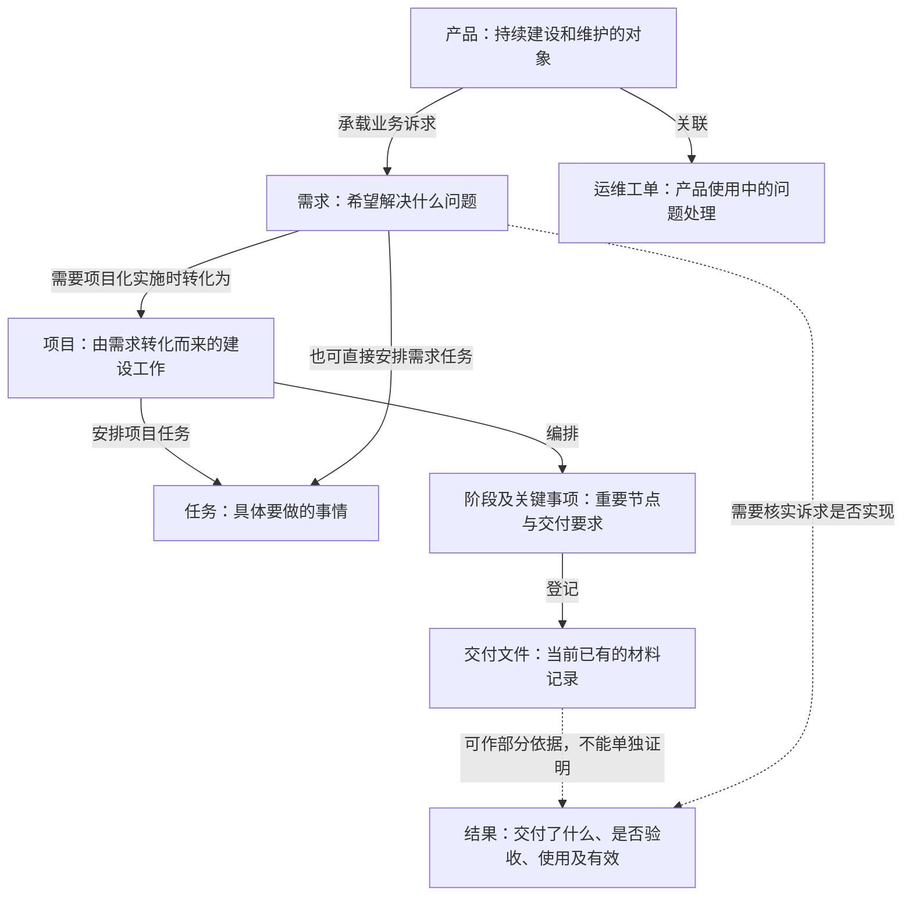

# SIDM 业务骨架

V0.2 · 2026-09-21 · 后续迭代共同底稿。需求先于项目、项目由需求转化而来的关系已由用户明确；其余业务含义继续审阅。本轮仅修订文档。

## 1. 一句话说清 SIDM

**围绕数字化产品，把业务诉求、建设工作、交付结果和持续运维连接起来，知道为什么做、谁在做、做到哪里、结果怎样。**

其中“结果怎样”是希望逐步补齐的管理能力。目前的完成状态、交付材料，不能直接证明已经验收、投入使用或产生收益。

## 2. 整体骨架

**业务主线：先提出需求，需要通过项目组织实施的需求，再转化为项目；项目安排阶段关键事项和具体任务，逐步形成交付。**

产品是这些建设和运维工作所围绕的对象。交付之后，还要分别核实验收、使用和效果。

**实线表达业务关系，具体含义看连线文字；虚线表示需要证据支持的结果判断。**项目也归属产品，为突出需求到项目的主线，图中省略该连线。“结果”是本骨架的观察角度，尚不是一张已存在的统一业务表。

这张图有四条边界：

- **先有需求，才能转化为项目。**项目必须有来源需求，不能脱离需求独立产生；需求转化后仍保留，便于追溯为什么做。
- **有需求不等于一定有项目。**需求可以尚未转化，也可以直接安排任务；具体转化条件后续梳理，不在本轮推定。
- **任务直接关联项目或需求，二者择一。**图中两条连线表示两种来源，不表示每条任务同时挂两边；项目任务可通过项目追溯来源需求。
- **阶段关键事项与任务分别表达重要节点和执行工作。**当前没有直接关联，不能凭名称或排序自行连线。

## 3. 每个部分到底是什么

| 部分 | 大白话定义 | 例子与边界 |
|---|---|---|
| 产品 | 持续建设、使用和维护的数字化对象 | “经营分析平台”；不是一次项目做完就结束 |
| 需求 | 希望解决的问题或需要实现的改变 | “月报不要再手工汇总”；不等于已经批准建设 |
| 项目 | 由需求转化而来，为落实该需求组织的建设工作 | “月报自动汇总建设项目”；必须能够追溯来源需求 |
| 阶段及关键事项 | 项目重要节点和应交付内容的安排 | “完成联调”“提交验收材料”；顺序不自动代表依赖 |
| 任务及子任务 | 分配给人员的具体工作及拆分 | “完成财务接口联调”；当前支持一层子任务、多名平级负责人 |
| 交付与结果 | 分清产出了什么、是否接受、是否使用、是否有效 | 功能上线、验收结论、使用记录、效果数据各需自己的依据 |
| BUG 与运维工单 | 缺陷处理与产品运维问题处理 | 两类记录保留各自状态与规则，不强行合并 |
| 合同与付款 | 建设及服务中的商务约定和付款登记 | 项目合同、产品运维合同分别管理；付款登记不等于业务收益 |

上表是业务层次，不要求每一行新建一张表。“交付与结果”已有部分材料承载，验收、使用与效果如何统一表达，仍需业务确认。

## 4. 所有部分共用四类信息

| 共用信息 | 必须问清什么 | 不能混淆什么 |
|---|---|---|
| 人与责任 | 谁提出、谁负责、谁参与、谁有权操作 | 负责人不自动等于提出人或验收人；多人负责不擅自选唯一主责 |
| 状态与时间 | 当前如何、计划何时、实际何时、发生过什么变化 | 各类对象的“完成”含义不同；更新时间不一定是业务发生时间 |
| 规则与动作 | 什么条件下能做什么，谁能做，做完如何核实 | 优先复用现有规则；文字说明不替代系统权限与执行校验 |
| 来源与证据 | 判断来自哪条记录、哪份材料、哪个人，是否足够 | 没查到不一定不存在；附件存在不等于验收通过 |

这四类是共同检查框架，不宣称现在每个对象都已完整具备。

## 5. 用一个例子串起来

以下是虚构示例，用于理解，不代表已发生的业务。

业务部门提出“月报手工汇总太慢”，这是**需求**，归属“经营分析平台”这个**产品**。当这个需求需要通过项目组织实施时，由它转化出“月报自动汇总建设**项目**”。项目分别安排联调、交付等**关键事项**和接口开发、报表核对等**任务**；需求也可以直接安排任务，具体适用条件另行梳理。这里描述工作安排，不表示阶段事项与任务已有直接数据关联。

代码或功能是产出，交付材料是部分证据。接下来还要分别问：业务方接受了吗？实际使用了吗？汇总时间是否缩短了？**任务完成，只能回答其中一部分问题。**使用中发现的问题通过相应运维记录处理。

未来问“这个项目进展怎么样”，就是沿这套骨架查相关事实；问“能不能完成任务”，就是使用同一套任务定义，再检查对应规则。无需为每个问题重建一套业务知识。

## 6. 以后怎样围绕骨架迭代

**本文件负责共同定义和核心关系，作为后续设计入口；业务规则、案例和技术映射分开补充，避免全部堆进本文。**现有总体蓝图保留为研究背景；建设顺序以本轮“先骨架、后验证”的约定为准。

每次增加能力，按四步进行：

1. **找到位置**：它涉及哪些已有对象？例如“任务暂停”仍属于任务，不另建一套任务模型。
2. **复用再补充**：引用已有定义，只补真正缺少的关系、规则或证据。例如“项目交付判断”可能需要补充验收含义。
3. **拿案例验证**：用正常情况和例外检查是否说得通、查得到；不足的地方保留未知。
4. **同步维护**：定义变更记录原因、业务确认情况及影响范围；检查相关规则、数据映射和案例，保留旧版本对应关系。

共同概念使用稳定名称和标识；改名保留旧名对应，不因场景不同重复定义。改变业务含义由对应业务人员确认，技术负责映射与执行一致性，AI 辅助整理。具体维护人与确认人待指定。

**骨架是可修订的基线。**真实业务证明某个概念或关系不准确时，应修订并检查影响，不能为了维持图形不变而强迫业务适配。

## 7. 这一版之后做什么

已明确的基础是：**先有需求，项目由需求转化而来。**接下来围绕这条主线核对产品归属、项目内的工作安排和结果判断；需求转项目的具体条件，以及验收、使用、效果的认定口径，后续用真实案例补充。

然后选一个真实项目，沿骨架走一遍，产出一页**《项目业务事实样例》**：有什么需求、哪些事项和任务、谁负责、有什么交付依据、哪些信息未知。先验证骨架是否贴合实际，再决定补哪些规则和机器模型。

本轮不建设 OWL、图数据库或 Agent；不新增业务字段、修改数据、提交 Git 或发布系统。

---

依据与范围：复用[现状证据附录](/Users/sunxinxin/Documents/Project/SIDM/docs/SIDM本体建设现状证据.md) E02～E18 的源码盘点及[总体蓝图](/Users/sunxinxin/Documents/Project/SIDM/docs/SIDM本体建设总体蓝图.md)；V0.1 曾复核任务结构及移除阶段事项关联的迁移，V0.2 根据用户明确的业务关系修订需求到项目的主线、定义和案例。未重新核验全部实现、生产数据或实际接口，既有盘点不代表线上现状已验收。
