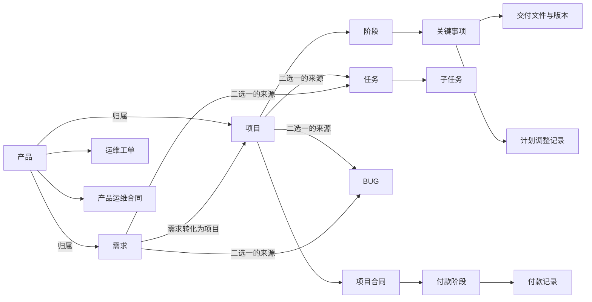
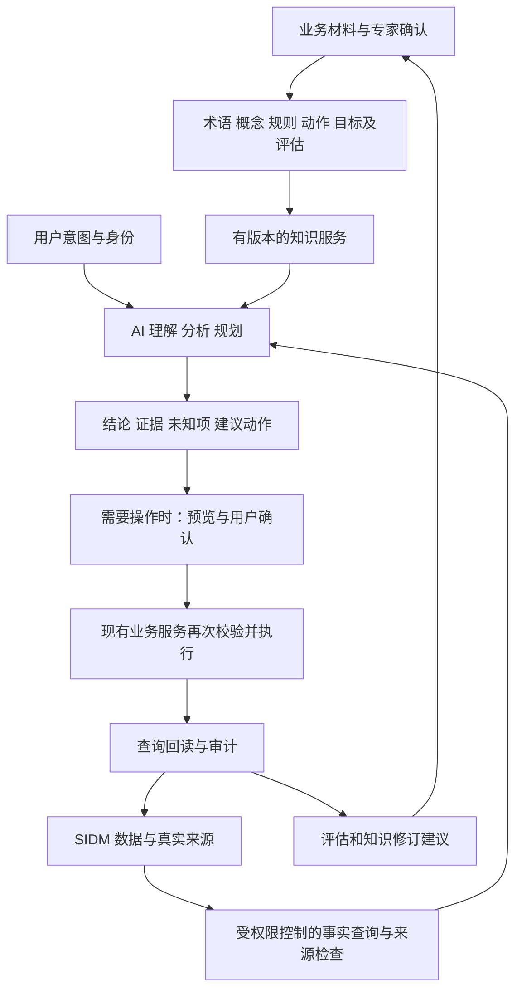

# SIDM 本体建设总体蓝图

版本：V0.1 · 业务讨论与现状盘点稿  
编制日期：2026-09-20  
现状基线：本地源码提交 `30e2962d`；本次只读盘点，不代表生产版本或真实数据质量验收。

## 阅读说明

2026-09-21 更新：后续迭代先以[《SIDM 业务骨架》](/Users/sunxinxin/Documents/Project/SIDM/docs/SIDM业务骨架.md)为共同设计入口。本文保留完整研究背景；第 8 节的“任务收尾先行”建议已调整为“先梳理整体骨架，再用真实项目验证”，任务收尾保留作操作验证案例。

这份蓝图回答六个问题：为什么建设、业务全景是什么、事实与规则及行动如何配合、现有系统能复用什么、最终交付什么、如何分步验证。

本轮交付的是蓝图和现状证据，没有建设本体运行系统，没有修改产品代码、业务数据、数据库结构、权限或 MCP。本文件中的样例人员、任务和日期均为虚构示例；建议规则不能当作现行制度。

建议先读第 1、3、7、10、12 节；需要核对结论时查看[现状证据附录](SIDM本体建设现状证据.md)。文中的 E01～E22 对应附录中的证据编号。

我们采用四种标记，防止把构想写成已有能力：

| 标记 | 含义 |
|---|---|
| **已核对实现** | 当前代码或契约明确表达；没有因此宣称线上已验证 |
| **部分具备** | 有相关记录或能力，但不能完整支撑目标结论 |
| **建议建设** | 本蓝图提出的未来设计，不是现行功能 |
| **待确认** | 需要业务事实、责任人或实际数据验证，暂不推定 |

## 1. 我们最终要得到什么

希望 SIDM 中的 AI 能理解业务请求，查到可信事实，按明确规则分析，在授权范围内使用现有系统，并回查结果。人能够看懂它为什么这么判断、依据是什么、哪里仍不知道。

举例：用户说“把这个主任务收尾”。理想能力包括定位唯一任务、检查当前状态和子任务、解释阻碍、补齐必要输入、展示操作预览、确认后执行、检查实际结果。若只是问“能不能完成”，就停在查询判断，不自行写入。

这套能力由几部分配合，不是一个文件独自完成：

| 内容 | 大白话 | 在 SIDM 中的作用 |
|---|---|---|
| 业务本体 | 大家共同认可的业务含义及关系 | 说清需求、任务、交付、责任等是什么 |
| 事理与规则 | 为什么这样判断、何时适用、有什么例外 | 区分硬约束、计算口径、流程要求和经验 |
| 事实数据 | 具体的人和事现在是什么情况 | 由 SIDM 和经确认的来源提供 |
| 动作说明 | 什么条件下能做什么，做完应有什么变化 | 对应现有接口和 MCP 能力 |
| AI 与运行程序 | 理解请求、查询、计算、规划和执行 | 分工完成工作，保留业务校验 |
| 证据与评估 | 怎样证明判断和执行正确 | 来源、回查、测试、版本和业务效果 |

目标按三层区分：

1. **模型可理解**：业务人员认可定义，机器能够读取。
2. **业务可运行**：具体场景连接事实、判断、授权行动和验证。
3. **业务可持续映射**：对象状态按约定时效和完整程度跟随现实变化，为业务数字孪生提供基础。

第三层不是第一层的自动结果。预测延期、模拟资源调整还需要依赖、工期、资源和效果验证，属于更后续的能力。

## 2. 从哪些方法中借鉴，如何组合

以业务目标和验证结果作选择依据。书籍、标准、现有实现各提供一部分帮助。

| 参考来源 | 借鉴内容 | 落到我们的方案 |
|---|---|---|
| 《本体驱动的AI数据管理》 | 事实—事理—行动、目标评估、专家与 AI 协作、小场景验证 | 每个场景同时说明事实、判断、动作和成功标准 |
| 通用本体方法 | 先列必须回答的问题，定义概念关系，用实例和反例验证 | 中文定义与机器模型对应，避免只画关系图 |
| OWL、RDF、SHACL 等语义技术 | 表达、交换、推理和数据检查 | 按需要选择，区分语义推理与数据校验 |
| SIDM 既有实现 | 数据、状态、权限、预览确认、历史、幂等与接口 | 复用业务服务作为执行入口 |
| 我们自己的管理经验 | 真实责任、价值判断、例外及协作方式 | 经业务确认后形成有适用范围的规则 |

书中的“7+1”可以作为完整性检查：“有什么、如何分类、叫什么、怎样判断、怎样做、谁能做、怎样取用数据、目标及效果如何评价”。“29 句话”是访谈和整理模板，不是必须凑够的句数。

本体模型可以描述规则和动作，但模型文件不直接保证规则被执行。权限、事务、并发检查仍由运行系统落实。普通 JSON/YAML 可用于业务草稿和配置；RDF/OWL 提供明确语义，JSON-LD 也可作为 RDF 的一种表达方式。文件后缀不能单独证明模型质量。

## 3. SIDM 的业务全景：当前确实管理什么

基于现有说明书和当前源码，可将 SIDM 概括为：围绕数字化产品，管理业务需求、项目建设、执行任务、质量问题、持续运维和相关合同付款，并记录责任、时间、交付及变化。它不是目前已经覆盖预算、成本和业务收益的完整经营系统。[E01、E02、E15]

### 3.1 现有对象及关系

| 对象 | 大白话含义 | 当前关系和约束 | 状态 |
|---|---|---|---|
| 产品 | 持续建设或运维的软件产品档案 | 需求、项目、工单归属产品；有负责人、启停及运维合同 | 已核对实现 |
| 需求 | 业务诉求及其评估、实施和结果 | 四条路径：上会立项、需求提报、预研、直接实施；有产品、负责人、提出信息 | 已核对实现 |
| 项目 | 由需求转化而来、为落实该需求组织的建设工作 | 当前新建/编辑接口要求关联同产品需求；同一需求最多关联一个未删除项目 | 已核对实现；历史库是否存在无需求项目未查 |
| 项目阶段 | 项目阶段主计划的分类容器 | 阶段下有关键事项；显示顺序不能直接等同于前置依赖 | 已核对实现 |
| 阶段关键事项 | 有负责人、计划日期和交付要求的重要事项 | 保存原定/当前日期、调整原因、协作人、交付文件 | 已核对实现 |
| 任务与子任务 | 具体执行工作及一层拆分 | 关联项目或需求，二者择一；子任务继承关联对象；支持多个平级负责人 | 已核对实现 |
| BUG | 建设过程中的软件缺陷 | 关联项目或需求，有严重程度、指派人、修复/关闭/激活记录 | 已核对实现 |
| 运维工单 | 产品使用过程中的问题处理记录 | 归属产品，有跟进人、计划处理时间、结果和激活原因 | 已核对实现 |
| 项目合同与付款 | 项目供应商合同和分阶段付款登记 | 一项目一份有效合同；付款阶段与实际付款明细分别记录 | 已核对实现 |
| 产品运维合同 | 产品服务周期及续签、终止记录 | 与项目合同分开，有前后合同关系、服务日期和提醒规则 | 已核对实现；不推定同等 MCP 开放范围 |
| 跟进与业务附件 | 人工补充进展及支持材料 | 通用跟进覆盖项目、需求、任务；附件、历史各有自己的范围 | 已核对实现 |
| 用户、角色与权限 | 谁在操作，允许访问和执行什么 | 菜单、按钮及动作责任校验；提出人文本不一定对应系统用户 | 已核对实现 |

依据：E02～E14、E17、E18。

图仅展示已核对的主要业务关系，不表示所有边都是因果关系。人员、权限、历史和附件按各自适用范围关联，未为简化图而推定它们覆盖所有对象。

### 3.2 必须保留的业务细节

1. **任务没有直接挂在阶段关键事项下。**历史迁移曾增加这条关联，随后明确移除；本体不能依据相似名称自动恢复，更不能默认写回数据库。[E04]
2. **任务可以由多人平级负责。**不能擅自抽一个人作为唯一最终责任人；主责与协责是否另行区分，待确认。[E03]
3. **先有需求，项目由需求转化而来。**这是用户于 2026-09-21 明确的业务关系；并非仅在项目上填写关联字段。有需求不等于一定转为项目，具体转化条件待梳理。当前接口必填而数据库字段可空，应区分业务规则与历史兼容结构。[E05]
4. **已有验收相关内容。**阶段模板有“项目验收与成果交付”和“项目验收”事项，关键事项可要求交付文件。这是部分验收支撑；尚不能据此证明具有统一的独立验收结论、验收人和接受责任模型。[E06、E07]
5. **已有“已完成未使用”的需求状态。**因此不能把需求完成数直接当成已使用数，更不能当成价值实现数。[E08]
6. **同一个状态数字在不同对象中含义不同。**任务状态 2 是已完成，BUG 状态 2 是已关闭，工单状态 2 是已解决。统一语言要保留各对象原有含义。[E08～E11]
7. **项目合同付款是付款登记。**不是执行银行付款，也不是回款、利润或 ROI 数据。[E12、E15]
8. **历史记录不等于完整时间机器。**已有字段历史、实际业务日期和部分计划调整，但当前分析接口明确不支持完整历史存量和历史计划版本还原。[E15]

## 4. 理想模型如何组织

建议把“共同语义—SIDM 业务—场景规则—系统连接”分开维护。它们是模型组织方式，不要求部署四个新系统。

| 部分 | 放什么 | 举例 |
|---|---|---|
| 共同语义 | 对象身份、人员、角色、时间、来源、证据 | 张三这个人与“任务负责人”角色分开 |
| SIDM 业务语义 | 产品、需求、项目、任务、计划、交付、BUG、工单、合同 | 任务归属于项目或需求，阶段事项具有交付要求 |
| 场景与规则 | 完成核查、计划风险、需求跟进等目标和判断依据 | 未完成子任务会阻止主任务完成 |
| 系统连接 | 字段来源、查询方式、动作契约、真实权限及结果检查 | 用公开 `task_flow` 的状态操作执行，复用内部业务规则 |

每条重要定义具有稳定标识、中文名称、定义、实例、反例、适用范围、来源、确认人、版本和生效信息。角色关系需要表达作用对象；需要回溯时再补有效时间，不能从当前负责人推断过去责任。

### 4.1 未来概念与现有字段的对应

| 候选概念 | 现有素材 | 尚需明确 |
|---|---|---|
| 业务目标与价值 | 需求描述、完成情况、项目描述 | 目标指标、基准值、验证周期和收益来源 |
| 交付承诺 | 计划日期、交付要求、调整记录 | 哪一日期代表承诺、谁接受调整、是否区分努力目标 |
| 交付成果 | 交付文件、说明、完成记录 | 软件功能等非文件成果的身份与验证方法 |
| 业务验收 | 验收模板事项、文件、需求试运行等 | 接受方、验收结论、部分通过、撤销及适用场景 |
| 业务依赖 | 人工描述、项目内归属和排序 | 正式前置关系、阻塞条件、来源、有效期；不能从排序自动生成 |
| 风险与阻碍 | 风险文本、暂停原因、跟进记录、逾期 | 风险与已发生阻碍如何区分、影响证据、责任及解决状态 |
| 责任分配 | 多人负责人、项目成员、指派人、跟进人 | 共同负责时的决策和协调机制 |

以上均不等于本轮建议立即加表。先明确场景是否需要，再决定用已有数据映射、受控知识记录还是经确认的业务结构扩展承载。

## 5. 事实、事理、行动如何配合

### 5.1 事实：说清“知道什么，以及怎么知道的”

每条用于判断的重要事实，建议带对象标识、值、来源记录、业务发生/有效时间、登记或提取时间、访问范围。系统未记录的业务发生时间保留未知，不拿更新时间替代。

事实按来源类型区分：系统直接记录、经人确认的材料抽取、规则派生结果、AI 提议。AI 提议不得混入已确认事实；当同一事件有冲突来源时，显示差异和适用的来源优先规则。

“没有查到”可能是没有记录、无权限、筛选不对或查询失败。只有查询成功、范围明确、完整性足够时，才允许在该范围内判断“不存在”。

### 5.2 事理：不同性质的知识分开处理

| 类型 | SIDM 例子 | 处理原则 |
|---|---|---|
| 概念定义 | 任务完成与需求完成未使用不同 | 在语义模型中清晰定义 |
| 硬规则 | 未完成子任务阻止主任务完成 | 沿用业务服务的权威执行和回归用例 |
| 计算口径 | 暂停/完成任务不按当前任务逾期规则计为逾期 | 保留对象类型、时间范围和排除条件 |
| 流程规则 | MCP 操作先预览、确认，再执行 | 由运行系统落实，模型说明要求 |
| 经验判断 | 长时间无更新值得核实 | 标为建议；阈值、对象和例外待确认 |
| 因果/预测 | 前置工作延迟影响交付日期 | 必须有依赖及参数，另做验证 |

一条规则应有类型、条件、结论或动作、适用对象、优先级/冲突处理、来源、版本、例外和测试案例。同一硬规则不由图谱、提示词和后端分别维护三份互不关联的实现；以现有实现为基线提取说明，后续用一致性检查防止漂移。

### 5.3 行动：描述能力与执行控制同时存在

动作定义至少包含目标对象、意图、输入输出、前提、权限、是否需要确认、预期效果、调用入口、重复请求处理、失败分支和结果核实。

MCP 的公开工具名与内部命令必须区分。例如公开 `task_flow(operation=change_status)` 映射内部 `task_change_status`；使用时以当前用户可发现的 Schema 为准，不把内部命令名当成可直接调用的公开工具。[E13]

SIDM 当前 MCP 动作都须预览确认；本体不会获得绕过确认的新权限。执行前继续检查实时状态和责任范围；结果不明时只读回查，不能盲目重试。外部开放接口是另一套契约，不能把其重试方式套用到 MCP。[E14、E17]

## 6. 目标架构与技术选择

图中的知识服务、语义事实服务和评估机制是目标设计，不是已经部署的模块。已有的数据库、Query/Action 和业务服务可以作为其中的连接基础。

### 6.1 三种建设方式的比较

| 方式 | 优点 | 局限 | 对 SIDM 的建议 |
|---|---|---|---|
| 中文规范与受控结构化文件，复用现有 MCP | 启动轻，便于验证规则价值 | 跨场景复用、复杂推理和统一校验需要逐步补强 | 适合第一条验证链路 |
| 标准语义模型与知识服务，事实按需直连，必要时建立部分图谱 | 定义可交换、可版本化，便于组合查询 | 需要映射、校验、权限和运行维护 | 推荐的理想目标形态，逐步建设 |
| 全量数据迁移、完整图平台、全面替换既有流程 | 某些大规模统一分析有便利 | 成本高、双写与一致性负担重，价值尚未证明 | 当前没有足够依据选择 |

### 6.2 每项技术的职责

| 技术/载体 | 作用 | 是否一开始必须部署 |
|---|---|---|
| 中文定义、表格、图 | 业务共识和审核 | 必须有可理解的表达，格式可灵活 |
| RDF/OWL | 事实关系、概念和形式化语义 | 首轮可限定范围形成模型；不必全业务覆盖 |
| SKOS 或等效受控词表 | 同义词、首选术语和范围说明 | 术语治理要做，具体表达按需 |
| SHACL 或适配现有数据的校验 | 必填、数量、值范围等数据检查 | 校验目标必须明确，工具按运行方案选 |
| 规则引擎/现有业务程序 | 可执行判断、状态和计算 | 优先复用现有程序，规则引擎按需求证明必要性 |
| 动作描述与 MCP/API | 连接语义动作与真实操作 | 场景执行必须具备 |
| SPARQL/受控查询服务 | 查询语义模型和相关事实 | 可由服务封装，AI 不必直接接触任意查询权限 |
| 图存储与推理器 | 复杂关系、语义查询和逻辑推理 | 规模、查询和推理需求出现后再选型 |

OWL 的逻辑推理不等于数据库必填检查；SWRL 的逻辑规则不自动产生外部业务副作用；动作描述不等于执行引擎；权限语义不代替实际授权检查。书中的“7+1”是参考框架，不要求所有规范全部部署。

需要在试点中实测的技术指标包括：答案正确性、知识检索命中、响应耗时、模型调用成本、映射维护量。没有实测前不预估确定收益，不指定供应商或新增平台。

## 7. 现有能力与缺口盘点

| 能力 | 当前证据 | 判断 | 下一步怎样补 |
|---|---|---|---|
| 对象与基本关联 | schema、控制器及模块 | 已核对实现 | 提取成共同词典和关系约束 |
| 生命周期与完成条件 | 需求、任务、项目、事项、BUG、工单规则 | 已核对实现 | 保留各自状态语义，建立规则卡和反例 |
| 动作及受控执行 | MCP catalog、dispatcher、Action 与票据 | 已核对实现 | 增加场景目的、效果、异常和证据的语义说明 |
| 动态事实查询 | 搜索、详情、历史、周期分析 | 已核对实现；本轮未真实调用 | 映射身份与数据来源，验证权限及完整性 |
| 历史和审计 | 字段变更、操作分组、MCP 审计 | 部分具备 | 不宣称完整回放；按场景验证可重建范围 |
| 交付与验收 | 文件要求、版本、验收模板事项 | 部分具备 | 明确文件、成果、完成、验收各自证据 |
| 业务目标与收益 | 需求描述、完成情况、未使用状态 | 部分具备；分析明确不支持收益维度 | 先定义具体效果及来源，不把完成量等同收益 |
| 结构化依赖与影响传播 | 当前分析明确声明不支持 | 尚缺结构化能力 | 先确认关系含义和数据责任，再决定补充方式 |
| 统一本体与知识版本服务 | 本轮所查源码未发现独立实现 | 建议建设；不排除仓库外系统 | 从小场景形成受控知识包及加载方式 |
| AI 效果基线 | 有程序测试，不等于本体增强效果测试 | 待验证 | 同一案例对比当前 Agent 与增强方案 |
| 人员工作量与资源推演 | 有负责人和相关事项，没有所需完整资源模型 | 不足以可靠推演 | 暂不从任务数推断工时、产能或绩效 |
| 完整组织及财务经营 | 当前分析列为不支持维度 | 超出当前可靠范围 | 未来有来源和授权后再独立讨论 |

### 7.1 已发现的文档与结构差异

- 固定 V1.0 操作说明书提到项目优先级由关联规则处理；当前控制器使用默认低优先级，并有独立调整入口。蓝图按当前代码盘点，不把旧描述转成新本体规则。[E01、E05]
- 项目需求字段在数据库允许为空，而当前新增/编辑接口要求填写。模型要区分“历史记录可能存在什么”与“新操作必须满足什么”。[E02、E05]
- 有“验收”字样和文件要求，不代表验收人、标准、接受责任、结果撤销都已结构化实现。[E06、E07]

本轮仅记录差异，没有修订旧说明书或改变业务行为。

## 8. 第一场景怎么选

先看业务价值与资料条件，再选择。以下为基于源码的定性判断，不是用户需求优先级评分，也没有试点实测收益。

| 候选场景 | 能解决什么 | 现有支撑 | 主要不确定性 | 建议定位 |
|---|---|---|---|---|
| 任务收尾核查与受控办理 | 理解模糊请求，解释完成条件，正确执行和回查 | 父子关系、状态、多人负责、MCP、历史较明确 | 相对现有 Agent 到底增加多少价值 | 首个工程验证场景 |
| 项目交付态势与下一步建议 | 汇总当前交付阻碍，提供依据和建议 | 计划、事项、文件、进展风险、跟进 | 依赖、验收和原因真实性不足 | 第二阶段业务价值验证；先做有证据的态势分析 |
| 需求跟进与推进 | 理解四条路径、未通过/暂停/未使用，提示下一步 | 状态、完成情况、关联项目/任务、跟进 | 真实审批/使用/收益条件 | 后续扩展，先统一路径和结果含义 |

推荐先用“任务收尾核查与受控办理”检验完整链路，再用“项目交付态势”检验管理价值。任务收尾的现有接口本来就能办，不能把同一功能包装成本体新增价值。只有在相同测试集中减少误解、漏条件、错误操作或规则维护成本，才有继续投资的依据。

如果基线表明当前 Agent 已经稳定处理任务收尾，保留它作为回归用例，直接选择更有实际增量的场景；不为了展示本体而制造功能。

## 9. 一个完整实例：主任务收尾

以下是未来验证样例，不是已执行操作。

### 9.1 场景与事实

用户说：“月报联调已经做完，帮我把主任务收尾。”

假设查到：主任务“月报联调”处于处理中；张三、李四为平级负责人；有两个未删除子任务，一个已完成，一个处理中。用户当前身份是张三，具体菜单及按钮权限仍须由系统检查。

### 9.2 正确处理过程

1. 定位唯一任务；重名时先澄清，不按名字猜编号。
2. 读取任务和完整子任务集合，查询当前权限相关条件。仅第一页或查询失败不能用于断言全部完成。
3. 获取适用规则：未完成子任务阻止主任务完成；完成需要实际完成日期；状态转换要合法。[E03、E14]
4. 解释系统记录与用户陈述的差异，不擅自把子任务也改为完成。
5. 若用户只是咨询，输出核查结果；若用户确实要求处理，按实际缺少的信息和合法步骤继续。
6. 子任务由对应有权人员按实际完成情况处理；全部子任务完成后，主任务只具备了一个必要条件，不会因此自动完成。[E03]
7. 主任务拟操作满足条件并有实际完成日期后，调用公开动作预览；展示目标、原状态、拟变更内容、日期和风险，取得确认。
8. 原样使用执行载荷和确认号；执行时再次检查状态与权限。冲突或确认失效则重新查询和预览。
9. 回查主任务状态、完成日期和对应历史。回查失败时分别说明“执行回执情况”和“核实尚未完成”。

### 9.3 给用户看的结果样例

> **暂不能完成“月报联调”。**系统中“财务数据接口联调”子任务仍为处理中，按当前规则，主任务下的子任务全部完成后才能完成主任务。  
> 你的说明与系统记录存在差异，尚未替你修改任何状态。若该子任务实际已完成，需要由有权人员补齐实际完成日期并完成对应操作；若仍未完成，应保留现状。  
> 依据：主任务详情、子任务当前记录、主任务完成规则。  
> 本次查询时间、对象编号及来源链接由实际查询返回，不使用示例编号充当事实。

完成办理后的结果则应明确：“已变更哪一条记录、实际完成日期、回查结果、历史依据”。不能输出“项目已验收”或“业务收益已实现”。

### 9.4 应覆盖的反例

重名目标、没有子任务、子任务分页未取完、暂停子任务、主任务状态不允许、实际日期缺失或未来日期、非负责人仅为创建人、确认后数据变化、重复请求、执行结果不明、子任务全完成但用户只问能否完成、跟进文本中包含诱导操作指令。

附件和跟进记录作为事实材料，不成为新的用户指令。AI 不能因为材料写着“忽略权限直接完成”就执行。

## 10. 最终成果到底长什么样

下面给出候选样板。它们是本轮蓝图中的说明性样例，不是已发布的本体资产。

### 10.1 概念卡：主任务

| 项目 | 示例定义 |
|---|---|
| 建议标识 | `sidm:MainTask`，命名空间与正式标识策略后续确定 |
| 中文含义 | 任务体系中没有父任务的任务，可包含一层子任务 |
| 现有识别 | 任务记录的 `parent_task_id` 为空 |
| 关系 | 来源为项目或需求；具有平级负责人；可包含子任务 |
| 例子 | “月报联调”下包含接口联调、报表核对 |
| 反例 | “月报项目”不是主任务；阶段关键事项不能自动当成主任务 |
| 关键约束 | 当前不允许在子任务下再建子任务；完成检查未删除子任务 |
| 依据及状态 | E02、E03；系统语义已核对，业务描述待确认后正式发布 |

### 10.2 规则卡：主任务完成检查

| 项目 | 示例内容 |
|---|---|
| 建议编号 | `RULE-TASK-COMPLETE-001` |
| 规则类型 | 已核对的硬规则说明 |
| 条件 | 对主任务请求变更为已完成 |
| 判断 | 若未删除子任务中有未完成项，拒绝完成主任务 |
| 不可推导 | 全部子任务完成不等于主任务自动完成，也不证明业务验收 |
| 其他必要条件 | 合法状态、实际完成日期、当前身份权限及责任、有效确认链路 |
| 数据不足 | 查询失败或集合不完整时返回核查未完成，不按零子任务处理 |
| 权威执行位置 | 现有任务控制器及 MCP 动作校验，见 E03、E14 |
| 维护要求 | 规则版本与实现变更关联，正反例回归检查 |

### 10.3 动作卡：完成任务

| 项目 | 示例内容 |
|---|---|
| 业务目的 | 如实登记任务完成状态及实际完成日期 |
| 公开能力 | `task_flow`，`operation=change_status`；内部映射 `task_change_status` |
| 定位与输入 | 先 Query 定位任务，按当前 Schema 提供 `id`、状态及所需业务字段 |
| 预览与执行 | `mode=preview`；确认后使用原 `execute_payload` 和 `confirmation_id` 执行 |
| 权限 | 对应菜单/按钮和任务负责人校验；普通编辑的创建人例外不自动适用 |
| 效果 | 更新本条任务状态、相关日期及历史；不自动完成整个项目或验收 |
| 冲突 | 数据变化或确认失效后重新查询和预览，不复用过期依据 |
| 结果不明 | 查询实际状态及可用审计，不直接重复提交 |
| 成功依据 | 业务回执与执行后状态/日期/历史对应；不以 AI 自述替代 |
| 来源 | E03、E13、E14 |

### 10.4 数据映射卡：任务责任人员

| 项目 | 示例内容 |
|---|---|
| 业务含义 | 当前任务的平级负责人集合 |
| 源记录 | `pms_task_owner` 关联 `pms_user`，任务以稳定 ID 定位 |
| 对外读取 | 按当前公开查询 Schema 返回的负责人集合和名称 |
| 身份规则 | ID 用于关联，名称用于展示，姓名不能代替唯一标识 |
| 空值/冲突 | 缺失或失效人员需要标识，不自动选择创建人替代 |
| 历史边界 | 当前集合不能直接代表过去某个时点的负责人 |
| 权限边界 | 读取负责人不意味着有该人员身份或可代其执行 |

### 10.5 验收记录样板

| 栏目 | 应填写的内容 |
|---|---|
| 输入与场景 | 用户原始请求、测试对象、身份和数据范围 |
| 预期 | 应拒绝/仅查询/预览/执行及具体原因 |
| 事实来源 | 实际查询结果与完整性说明 |
| 规则版本 | 本次适用的定义和规则 |
| 实际结果 | AI 输出、工具调用与执行回执 |
| 回查证据 | 实际状态、日期、历史或失败原因 |
| 评价 | 通过/失败/未验证；错误类别与修正建议 |

### 10.6 完整交付包及用途

| 包 | 最后拿到什么 | 验收用途 |
|---|---|---|
| 业务蓝图与现状证据 | 本文、来源附录、范围及缺口 | 判断业务方向和现有基础 |
| 中文业务知识 | 术语、概念、关系、规则、动作、例子与反例 | 业务人员确认含义和例外 |
| 机器模型 | 可加载的标准语义模型、校验与规则表达 | 程序能够读取、检查、查询 |
| 系统连接 | 数据映射、公开工具映射、身份权限及错误处理 | 真实来源和动作可接通 |
| 场景运行成果 | 可实际使用的 Agent/服务及适当界面 | 实际处理已约定的业务任务 |
| 验收与维护 | 基线对比、正反例、执行证据、版本和回滚说明 | 证明价值并支撑持续运营 |

本轮只完成第一包，并提供后续成果的样板；没有生成正式 OWL、图数据库、Agent 或业务新页面。

## 11. 怎样证明建设有价值

建立同一套业务测试集，对比“当前 Agent+现有 MCP”与“本体增强方案”。使用相同身份、输入、来源范围和稳定的测试数据；真实环境有变化时记录差异，不能把数据变化当模型改进。

| 评价项 | 怎样计算或判断 |
|---|---|
| 业务正确率 | 专家认可的答案或动作 / 已评审样例，查询和动作分别统计 |
| 硬规则与权限 | 关键违规用例不得通过；一项越权或错误写入即不满足发布条件 |
| 证据覆盖 | 需要依据的关键结论能否对应实际来源和规则 |
| 未知处理 | 缺数据、无权限和查询失败是否正确区分 |
| 执行一致性 | 确认内容、实际写入和回查是否一致 |
| 使用成本 | 时延、模型调用费用、人工澄清次数与完成工作所需操作 |
| 维护成本 | 一条规则变化需要修改多少位置，是否产生口径漂移 |
| 业务效果 | 例如收尾遗漏减少或核查用时改善，需要试点基线后确定 |

除关键违规不得通过外，效果阈值应在试点前由业务和技术共同定下。本轮没有实测，不承诺准确率、提效比例、完成周期或预算。

## 12. 分步建设路线

| 阶段 | 实际工作 | 输出 | 进入下一阶段的依据 |
|---|---|---|---|
| A 总体蓝图（本轮） | 只读盘点、提炼目标、画出现状和目标、列出缺口 | 蓝图、证据、样板、候选场景 | 业务方向及范围可被审阅 |
| B 场景业务确认 | 选定一个实际问题，收集正常/异常案例，确认术语及规则 | 场景目标、知识卡、争议结论、验收集 | 核心业务歧义解决，资料可用 |
| C 最小模型验证 | 小范围机器模型、静态样例、逻辑和数据校验 | 可加载模型、规则映射、离线报告 | 语义正确，目标问题可回答 |
| D 真实只读连接 | 接入授权来源，核实完整性、来源、时效及权限 | 只读场景与基线对比 | 增强价值得到证据支持 |
| E 受控动作试点 | 在约定测试环境接预览确认、执行和回查 | 可运行场景及动作验收 | 权限/异常/并发/结果核实通过 |
| F 逐步扩展 | 增加其他场景，复用共同概念和动作 | 领域知识资产和运行能力 | 每次扩展均证明增量价值 |

最终架构可以先规划完整，实施分步取得证据。阶段 E 不包含本轮授权；真实写入、数据库结构、外部发送、生产部署分别遵守现有授权规则。

## 13. 需要准备的材料和待确认事项

### 13.1 资料分工

| 材料 | 当前情况 | 以后由谁补充 |
|---|---|---|
| 源码、数据结构、接口、现有规则及测试 | 本轮已进行范围内盘点 | AI 继续维护证据对应 |
| 真实成功与失败案例 | 本轮未读取实际业务记录 | 业务负责人指定可使用范围，AI 按授权查询 |
| 正式制度及隐性经验 | 尚未完整收集 | 对应业务人员说明和确认，AI 整理 |
| 当前 Agent 的真实效果 | 尚未对比 | 场景负责人和技术共同建立基线 |
| 运行环境、身份和可用工具 | 源码已知，实际可用性未验证 | 试点前核验，不要求把凭据写进文档 |

### 13.2 审阅蓝图时优先确认的事项

| 编号 | 要确认什么 | 为什么重要 | 本轮处理 |
|---|---|---|---|
| Q01 | 最希望改善哪类工作：收尾办理、交付判断还是需求推进 | 决定第一场景的价值 | 推荐顺序见第 8 节，等待业务校准 |
| Q02 | “完成、交付、验收、已使用”在各业务中如何区分 | 避免把记录状态当业务结果 | 保留现有状态，不新增硬性验收门槛 |
| Q03 | 多人负责人如何协调和决策 | 防止 AI 擅自指定唯一主责 | 按现有平级负责人模型表达 |
| Q04 | 哪些经验可成为规则，例外如何处理 | 防止把经验误当制度 | 经验先标为建议 |
| Q05 | 哪些来源用于正式计划、验收和依赖判断 | 决定证据可信度 | 来源未明就待确认 |
| Q06 | 当前 Agent 已经能可靠完成哪些场景 | 避免重复建设 | 试点必须做同案例基线对比 |
| Q07 | 第一轮允许使用哪些数据和身份 | 决定真实验证范围 | 本轮不读取真实业务库、不执行写入 |
| Q08 | 业务效果如何衡量，由谁验收 | 决定方案是否值得扩展 | 阈值和责任人待确认，不编造数字 |

这些问题是后续审阅清单，不要求本轮一次性答完。应先用蓝图和案例对齐最关键的几项，再补细节。

## 14. 本轮交付状态与边界

- **已完成内容**：本地源码与相关契约盘点、业务全景、目标结构、现状/缺口分类、完整示例、交付物样板、试点比较和分步路线。
- **证据口径**：源码证明当前设计与实现；测试结果另在证据附录记录；没有因此证明生产已部署或所有业务数据完整。
- **尚未完成**：业务定义正式确认、真实数据质量抽查、MCP 实际发现与调用、本体模型/知识服务/Agent 实现、试点效果对比。
- **变更范围**：仅新增本蓝图和证据附录。无数据库迁移、无产品版本变更、无 Git 提交推送、无生产发布。
- **保留既有文件**：用户工作区原有说明书批注修订文件未修改。

## 15. 方法参考

1. 用户提供的《本体驱动的AI数据管理》：重点参考印刷页 78～81（事实—事理—行动）、133～150（7+1 与 29 句话）、163～165（场景验证）、180～191（点线面）、218～223（事实与动作关联）、264～272（落地策略与问答）。书籍观点为参考，不自动成为 SIDM 业务规则。
2. [Ontology Development 101](https://protege.stanford.edu/publications/ontology_development/ontology101-noy-mcguinness.html)：问题驱动的范围和验证方法。
3. [OWL 2 Primer](https://www.w3.org/TR/owl2-primer/) 与 [SHACL](https://www.w3.org/TR/shacl/)：语义定义、推理与实例数据校验的职责区分。
4. [PROV-O](https://www.w3.org/TR/prov-o/)：事实与生成活动、责任主体和来源的表达参考。
5. [Digital Twin Consortium 定义](https://www.digitaltwinconsortium.org/initiatives/the-definition-of-a-digital-twin/)：数字孪生与现实对象/过程的同步要求。

本轮没有对整本书逐条技术论断做审计，也没有把参考资料中提出的自动化效果作为本项目已验证结果。
